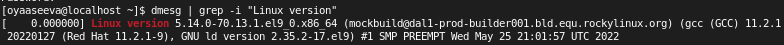
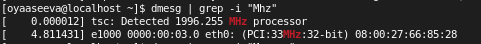
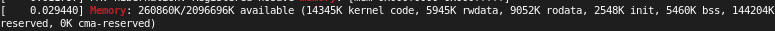
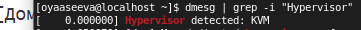
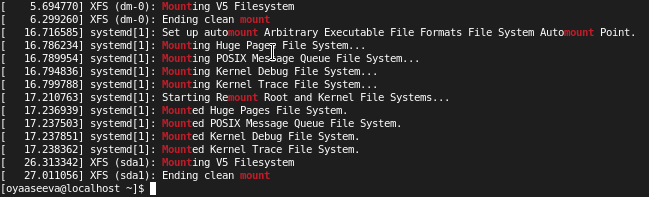

---
## Front matter
lang: ru-RU
title: Лабораторная работа №1
author: Асеева Яна Олеговна
documentclass: article
papersize: a4
toc: false
slide_level: 2
aspectratio: 20
section-titles: true
##Fonts
fontsize: 12pt
mainfont: PT Serif
romanfont: PT Serif
sansfont: PT Sans
monofont: PT Mono
mainfontoptions: Ligatures=TeX
romanfontoptions: Ligatures=TeX
sansfontoptions: Ligatures=TeX,Scale=MatchLowercase
monofontoptions: Scale=MatchLowercase,Scale=0.9
---

# 
Лабораторная работа №1

**Автор: Асеева Яна Олеговна**

**Группа: НКНбд-01-19**

## Прагматика выполнения

Получение знаний об установке ОС Rocky Linux, созданный Rocky Enterprise Software Foundation и вдохновленный изобретателем CentOS Грегори Куртцером, является совместимым производным бесплатного программного обеспечения Red Hat Enterprise Linux 8
  

  

## Цель выполнения лабораторной работы

Приобретение практических навыков установки операционной системы на виртуальную машину, настройки минимально необходимых для дальнейшей работы сервисов.

## Задачи

- Установить ОС Rocky Linux

- Вывести различную информацию о системе

## Информация о системе

Информация о системе:

1. Версия ядра Linux (Linux version)

   

2. Частота процессора (Detected Mhz processor)

   

3. Модель процессора (CPU0)

   

4. Объем доступной оперативной памяти (Memory available)

   

5. Тип обнаруженного гипервизора (Hypervisor detected)

   

6. Тип файловой системы корневого раздела 

   

7. Последовательность монтирования файловых систем

   

​    

 Спасибо за внимание!

