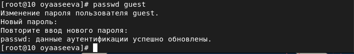
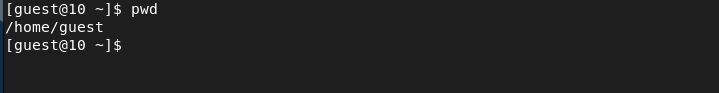
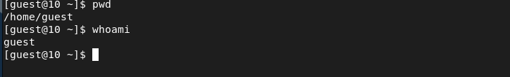
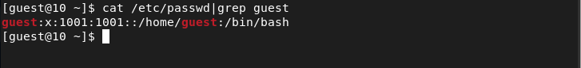
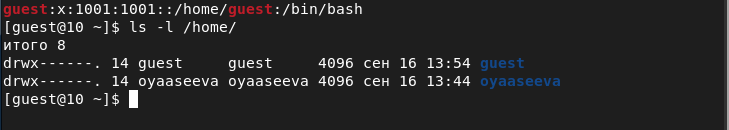

---
# Front matter
lang: ru-Ru
title: "Лабораторная работа №2"
subtitle: "Дискреционное разграничение прав в Linux. Основные атрибуты"
author: "Асеева Яна Олеговна"

# Formatting
toc-title: "Содержание"
toc: true # Table of contents
toc_depth: 2
lof: true # List of figures
lot: true # List of tables
fontsize: 12pt
linestretch: 1.5
papersize: a4paper
documentclass: scrreprt
polyglossia-lang: russian
polyglossia-otherlangs: english
mainfont: PT Serif
romanfont: PT Serif
sansfont: PT Sans
monofont: PT Mono
mainfontoptions: Ligatures=TeX
romanfontoptions: Ligatures=TeX
sansfontoptions: Ligatures=TeX,Scale=MatchLowercase
monofontoptions: Scale=MatchLowercase
indent: true
pdf-engine: xelatex
header-includes:
  - \linepenalty=10 # the penalty added to the badness of each line within a paragraph (no associated penalty node) Increasing the value makes tex try to have fewer lines in the paragraph.
  - \interlinepenalty=0 # value of the penalty (node) added after each line of a paragraph.
  - \hyphenpenalty=50 # the penalty for line breaking at an automatically inserted hyphen
  - \exhyphenpenalty=50 # the penalty for line breaking at an explicit hyphen
  - \binoppenalty=700 # the penalty for breaking a line at a binary operator
  - \relpenalty=500 # the penalty for breaking a line at a relation
  - \clubpenalty=150 # extra penalty for breaking after first line of a paragraph
  - \widowpenalty=150 # extra penalty for breaking before last line of a paragraph
  - \displaywidowpenalty=50 # extra penalty for breaking before last line before a display math
  - \brokenpenalty=100 # extra penalty for page breaking after a hyphenated line
  - \predisplaypenalty=10000 # penalty for breaking before a display
  - \postdisplaypenalty=0 # penalty for breaking after a display
  - \floatingpenalty = 20000 # penalty for splitting an insertion (can only be split footnote in standard LaTeX)
  - \raggedbottom # or \flushbottom
  - \usepackage{float} # keep figures where there are in the text
  - \floatplacement{figure}{H} # keep figures where there are in the text
---

# Цель работы

Получение практических навыков работы в консоли с атрибутами файлов, закрепление теоретических основ дискреционного разграничения доступа в современных системах с открытым кодом на базе ОС Linux. 

# Выполнение лабораторной работы

1.В установленной при выполнении предыдущей лабораторной работы операционной системе создала учётную запись пользователя guest (используя учётную запись администратора): useradd guest (рис.1)

рис.1

2.Задала пароль для пользователя guest (используя учётную запись администратора): passwd guest (рис.2)

рис.2

3.Вошла в систему от имени пользователя guest. (рис.3)

рис.3

4.Определила директорию, в которой я нахожусь, командой pwd. Для пользователя quest она является домашней и совпадает с приглашением командной строки. (рис.4)

рис.4

5.Уточнила имя пользователя командой whoami. (рис.5)

рис.5

6.С помощью команды id уточнила имя пользователя (1001(guest)), его группу (1001(guest)), а также группы, куда входит пользователь (1001(guest)), убедилась в верности с помощью команды groups. (рис.6)

рис.6

7.Просмотрела файл /etc/passwd командой cat /etc/passwd. Нашла в нём свою учётную запись. Определила uid (1001) пользователя. Определила gid пользователя (1001). Данные совпали  с информацией полученной ранее. (рис.7)

рис.7

8.Определила существующие в системе директории командой ls -l /home/. (рис.8)

рис.8

Полные права над директориями имеют только владельцы папок, другие атрибуты забраны.

9.Проверила, какие расширенные атрибуты установлены на поддиректориях, находящихся в директории /home: lsattr /home (рис.9)

рис.9

Я не смогла увидеть расширенные атрибуты текущей директории и директории другого пользователя.

10.Создала в домашней директории поддиректорию dir1 командой mkdir dir1. Определила командами ls -l и lsattr, какие права доступа и расширенные атрибуты были выставлены на директорию dir1. (рис.10)

рис.10

Права на чтение и выполнение есть у всех. Только у создателя и группы создателя имеются права на запись. Я не смогла просмотреть расширенные атрибуты.

11.Сняла с директории dir1 все атрибуты командой chmod 000 dir1 и проверила с её помощью правильность выполнения команды ls -l. (рис.11)

рис.11

12.Попыталась создать в директории dir1 файл file1 командой echo "test" > /home/guest/dir1/file1. (рис.12)

рис.12

Я получила отказ, потому что в предыдущем пункте забрала у себя все права директории dir1 и файл не был создан.

13.Оценила, как сообщение об ошибке отразилось на создании файла. Проверила командой ls -l /home/guest/dir1 действительно ли файл file1 не находится внутри директории dir1. (рис.13)

рис.13

Из-за отсутствия прав я также получила отказ.

14.Заполнила таблицу «Установленные права и разрешённые действия», выполняя действия от имени владельца директории (файлов), определив опытным путём, какие операции разрешены, а какие нет. Если операция разрешена, в таблицу занесен знак «+», если не разрешена, знак «-». (рис.14)

рис.14

15.На основании заполненной таблицы определила те или иные минимально необходимые права для выполнения операций внутри директории dir1. Заполнила таблицу «Минимальные права для совершения операций». (рис.15)

рис.15

# Выводы

В ходе выполнения лабораторной работы я получила практические навыки работы в консоли с атрибутами файлов, закрепила теоретические основы дискреционного разграничения доступа в современных системах с открытым кодом на базе ОС Linux.

# Список литературы

1.Кулябов Д. С., Королькова А. В., Геворкян М. Н Лабораторная работа №2.
