---
## Front matter
lang: ru-RU
title: Лабораторная работа №2
author: Асеева Яна Олеговна
documentclass: article
papersize: a4
toc: false
slide_level: 2
aspectratio: 20
section-titles: true
##Fonts
fontsize: 12pt
mainfont: PT Serif
romanfont: PT Serif
sansfont: PT Sans
monofont: PT Mono
mainfontoptions: Ligatures=TeX
romanfontoptions: Ligatures=TeX
sansfontoptions: Ligatures=TeX,Scale=MatchLowercase
monofontoptions: Scale=MatchLowercase,Scale=0.9
---

# 
Лабораторная работа №2

**Автор: Асеева Яна Олеговна**

**Группа: НКНбд-01-19**

## Цель выполнения лабораторной работы

Получение практических навыков работы в консоли с атрибутами файлов, закрепление теоретических основ дискреционного разграничения доступа в современных системах с открытым кодом на базе ОС Linux. 

## Создание пользователя guest

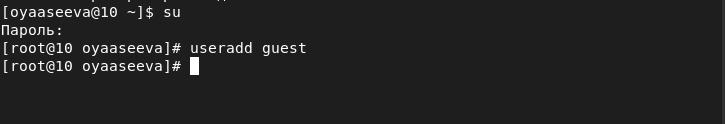

## Установка пароля

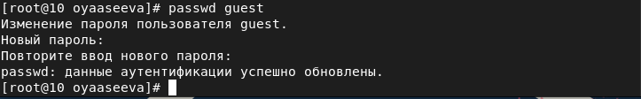

## Вход в систему для guest

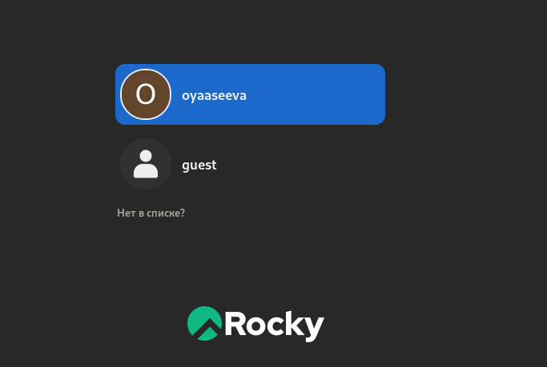

## Определение директории

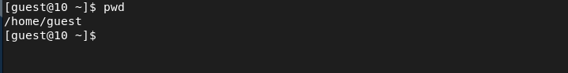

## Определение имени пользователя

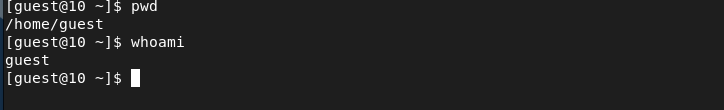

## Имя пользователя, его группа и группы, куда входит пользователь

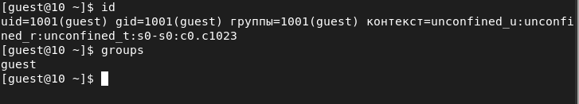

## Просмотр файла и учётной записи

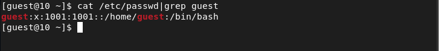

## Существующие в системе директории

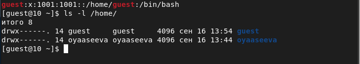

## Расширенные атрибуты на поддиректориях

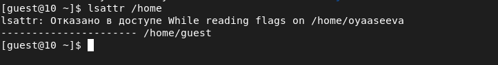

## Права доступа и расширенные атрибуты для dir1

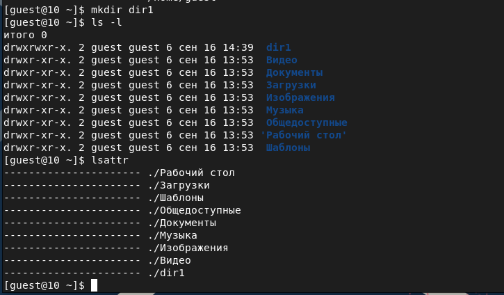

## Изменение атрибутов

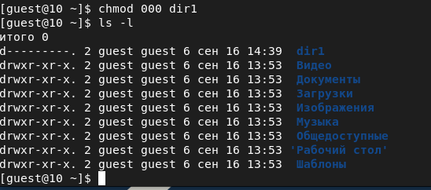

## Создание файла в директории

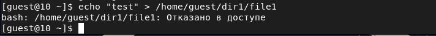

## Проверка

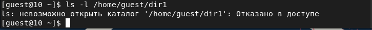

## Минимальные права для совершения операций 

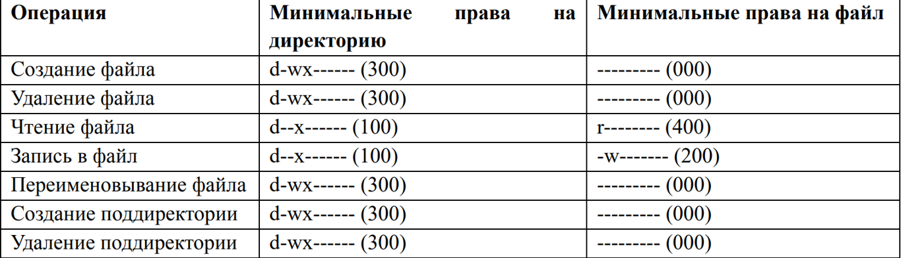

## Выводы

В ходе выполнения лабораторной работы я получила практические навыки работы в консоли с атрибутами файлов, закрепила теоретические основы дискреционного разграничения доступа в современных системах с открытым кодом на базе ОС Linux.
