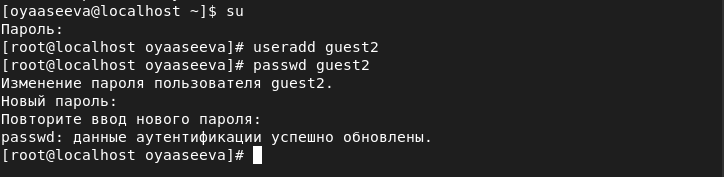
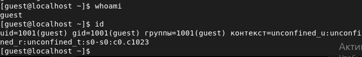
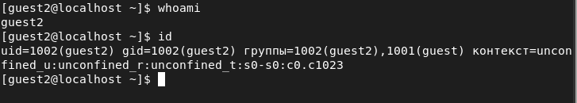
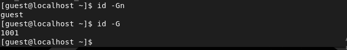
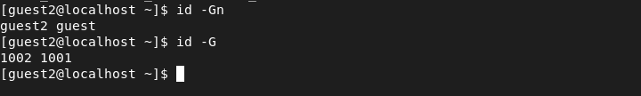
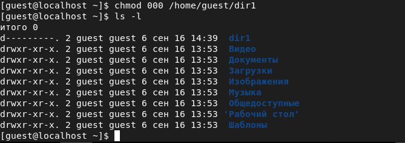

---
# Front matter
lang: ru-Ru
title: "Лабораторная работа №3"
subtitle: "Дискреционное разграничение прав в Linux. Два пользователя"
author: "Асеева Яна Олеговна"

# Formatting
toc-title: "Содержание"
toc: true # Table of contents
toc_depth: 2
lof: true # List of figures
lot: true # List of tables
fontsize: 12pt
linestretch: 1.5
papersize: a4paper
documentclass: scrreprt
polyglossia-lang: russian
polyglossia-otherlangs: english
mainfont: PT Serif
romanfont: PT Serif
sansfont: PT Sans
monofont: PT Mono
mainfontoptions: Ligatures=TeX
romanfontoptions: Ligatures=TeX
sansfontoptions: Ligatures=TeX,Scale=MatchLowercase
monofontoptions: Scale=MatchLowercase
indent: true
pdf-engine: xelatex
header-includes:
  - \linepenalty=10 # the penalty added to the badness of each line within a paragraph (no associated penalty node) Increasing the value makes tex try to have fewer lines in the paragraph.
  - \interlinepenalty=0 # value of the penalty (node) added after each line of a paragraph.
  - \hyphenpenalty=50 # the penalty for line breaking at an automatically inserted hyphen
  - \exhyphenpenalty=50 # the penalty for line breaking at an explicit hyphen
  - \binoppenalty=700 # the penalty for breaking a line at a binary operator
  - \relpenalty=500 # the penalty for breaking a line at a relation
  - \clubpenalty=150 # extra penalty for breaking after first line of a paragraph
  - \widowpenalty=150 # extra penalty for breaking before last line of a paragraph
  - \displaywidowpenalty=50 # extra penalty for breaking before last line before a display math
  - \brokenpenalty=100 # extra penalty for page breaking after a hyphenated line
  - \predisplaypenalty=10000 # penalty for breaking before a display
  - \postdisplaypenalty=0 # penalty for breaking after a display
  - \floatingpenalty = 20000 # penalty for splitting an insertion (can only be split footnote in standard LaTeX)
  - \raggedbottom # or \flushbottom
  - \usepackage{float} # keep figures where there are in the text
  - \floatplacement{figure}{H} # keep figures where there are in the text
---

# Цель работы

Получение практических навыков работы в консоли с атрибутами файлов для групп пользователей. 

# Выполнение лабораторной работы

1.В Лабораторной работе №2 с помощью учётной записи администратора была создана учётная запись пользователя guest (useradd guest) и задан пароль для него (passwd guest).  Аналогично я создала второго пользователя guest2. (рис.1)

рис.1

2.Добавила пользователя guest2 в группу guest: gpasswd -a guest2 guest. (рис.2)

рис.2

3.Осуществила вход в систему от двух пользователей на двух разных консолях: guest на первой консоли (рис.3) и guest2 на второй консоли (рис.4).

рис.3

рис.4

4.Для первого (рис.5) и второго (рис.6) пользователей командой pwd определила директорию, в которой я нахожусь. 

рис.5

рис.6

5.Уточнила для первого (рис.7) и второго (рис.8) пользователя имя, его группу, кто входит в неё и к каким группам принадлежит он сам. Определила командами groups guest и groups guest2, в какие группы входят пользователи guest (рис.9) и guest2 (рис.10). Сравнила вывод команды groups с выводом команд id -Gn и id -G для первого (рис.11) и второго пользователей (рис.12): в отличие от первых двух команд, последняя команда выводит код группы пользователя.

рис.7

рис.8

рис.9

рис.10

рис.11

рис.12

6.Сравнила полученную информацию с содержимым файла /etc/group. Просмотрела файл командой cat /etc/group. (рис.13)

рис.13

Полученная информация совпадает с информацией, которую я получила ранее. 

7.От имени пользователя guest2 выполнила регистрацию пользователя guest2 в группе guest командой newgrp guest. (рис.14)

рис.14

8.От имени пользователя guest изменила права директории /home/guest, разрешив все действия для пользователей группы: chmod g+rwx /home/guest. (рис.15)

рис.15

9.От имени пользователя guest сняла с директории /home/guest/dir1 все атрибуты командой chmod 000 dir1 и проверила правильность снятия атрибутов. (рис.16)

рис.16

10.Меняя атрибуты у директории dir1 и файла file1 от имени пользователя guest и делая проверку от пользователя guest2, заполнила таблицу, определив опытным путём, какие операции разрешены, а какие нет. Если операция разрешена, занесла в таблицу знак «+», если не разрешена, знак «-». (рис.17-20)

рис.17

рис.18

рис.19

рис.20

11.Сравнила полученную таблицу с таблицей из Лабораторной работы №2: таблицы не совпадают, так как у членов группы нет прав изменять атрибуты файла. 

12.На основании заполненной таблицы определила те или иные минимально необходимые права для выполнения пользователем guest2 операций внутри директории dir1 и заполнила таблицу. (рис.21)

рис.21

# Выводы

В ходе выполнения лабораторной работы я получила практические навыки работы в консоли с атрибутами файлов для групп пользователей.  

# Список литературы

1.Кулябов Д. С., Королькова А. В., Геворкян М. Н Лабораторная работа №3.
