---
## Front matter
lang: ru-RU
title: Лабораторная работа №3
author: Асеева Яна Олеговна
documentclass: article
papersize: a4
toc: false
slide_level: 2
aspectratio: 20
section-titles: true
##Fonts
fontsize: 12pt
mainfont: PT Serif
romanfont: PT Serif
sansfont: PT Sans
monofont: PT Mono
mainfontoptions: Ligatures=TeX
romanfontoptions: Ligatures=TeX
sansfontoptions: Ligatures=TeX,Scale=MatchLowercase
monofontoptions: Scale=MatchLowercase,Scale=0.9
---

# 
Лабораторная работа №3

**Автор: Асеева Яна Олеговна**

**Группа: НКНбд-01-19**

## Цель выполнения лабораторной работы

Получение практических навыков работы в консоли с атрибутами файлов для групп пользователей. 

## Создание пользователя guest2

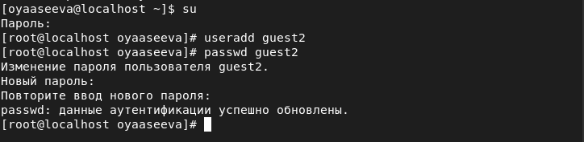

## Добавление guest2 в группу guest

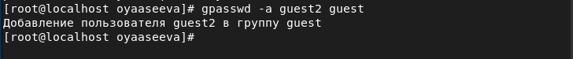

## Вход в систему от двух пользователей на двух разных консолях

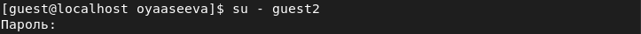

## Определение директории

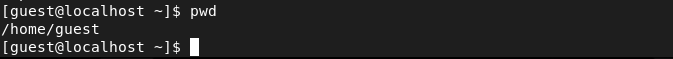

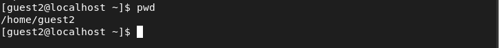

## Имя, группа, кто входит в неё и к каким группам принадлежит пользователь guest и guest2

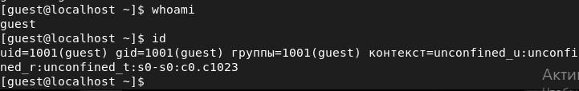

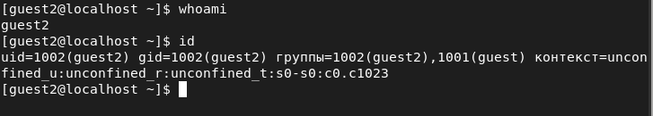

## Группы guest и guest2

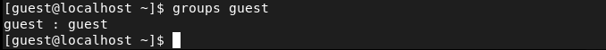

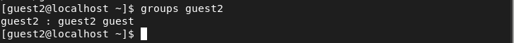

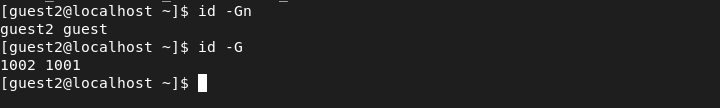

## Просмотр файла /etc/group

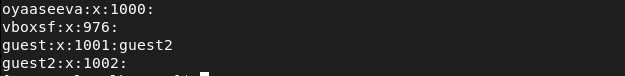

## Регистрация пользователя guest2 в группе guest

## Изменение прав директории /home/guest

## Снятие с директории /home/guest/dir1 всех атрибутов

## Минимально необходимые права для выполнения пользователем guest2 операций внутри директории dir1

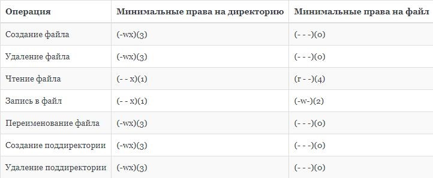

## Выводы

В ходе выполнения лабораторной работы я получила практические навыки работы в консоли с атрибутами файлов для групп пользователей.  

