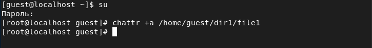

---
# Front matter
lang: ru-Ru
title: "Лабораторная работа №4"
subtitle: "Дискреционное разграничение прав в Linux. Расширенные атрибуты"
author: "Асеева Яна Олеговна"

# Formatting
toc-title: "Содержание"
toc: true # Table of contents
toc_depth: 2
lof: true # List of figures
lot: true # List of tables
fontsize: 12pt
linestretch: 1.5
papersize: a4paper
documentclass: scrreprt
polyglossia-lang: russian
polyglossia-otherlangs: english
mainfont: PT Serif
romanfont: PT Serif
sansfont: PT Sans
monofont: PT Mono
mainfontoptions: Ligatures=TeX
romanfontoptions: Ligatures=TeX
sansfontoptions: Ligatures=TeX,Scale=MatchLowercase
monofontoptions: Scale=MatchLowercase
indent: true
pdf-engine: xelatex
header-includes:
  - \linepenalty=10 # the penalty added to the badness of each line within a paragraph (no associated penalty node) Increasing the value makes tex try to have fewer lines in the paragraph.
  - \interlinepenalty=0 # value of the penalty (node) added after each line of a paragraph.
  - \hyphenpenalty=50 # the penalty for line breaking at an automatically inserted hyphen
  - \exhyphenpenalty=50 # the penalty for line breaking at an explicit hyphen
  - \binoppenalty=700 # the penalty for breaking a line at a binary operator
  - \relpenalty=500 # the penalty for breaking a line at a relation
  - \clubpenalty=150 # extra penalty for breaking after first line of a paragraph
  - \widowpenalty=150 # extra penalty for breaking before last line of a paragraph
  - \displaywidowpenalty=50 # extra penalty for breaking before last line before a display math
  - \brokenpenalty=100 # extra penalty for page breaking after a hyphenated line
  - \predisplaypenalty=10000 # penalty for breaking before a display
  - \postdisplaypenalty=0 # penalty for breaking after a display
  - \floatingpenalty = 20000 # penalty for splitting an insertion (can only be split footnote in standard LaTeX)
  - \raggedbottom # or \flushbottom
  - \usepackage{float} # keep figures where there are in the text
  - \floatplacement{figure}{H} # keep figures where there are in the text
---

# Цель работы

Получение практических навыков работы в консоли с расширенными атрибутами файлов.

# Выполнение лабораторной работы

1.От имени пользователя guest определила расширенные атрибуты файла /home/guest/dir1/file1 командой lsattr /home/guest/dir1/file1. (рис.1)

рис.1

2.Установила командой chmod 600 dir1/file1 на файл file1 права, разрешающие чтение и запись для владельца файла. (рис.2)

рис.2

3.Попробовала установить на файл /home/guest/dir1/file1 расширенный атрибут a от имени пользователя guest: chattr +a dir1/file1. В ответ получила отказ от выполнения операции. (рис.3)

рис.3

4.Повысила свои права с помощью команды su. Попробовала установить расширенный атрибут a на файл /home/guest/dir1/file1 от имени суперпользователя: chattr +a /home/guest/dir1/file1. В ответ отказ от выполнения операции не получила. (рис.4)

рис.4

5.От пользователя guest проверила правильность установления атрибута: lsattr dir1/file1. (рис.5)

рис.5

6.Выполнила дозапись в файл file1 слова «test» командой echo "test" dir1/file1. После этого выполнила чтение файла file1 командой cat dir1/file1. Убедилась, что слово test было успешно записано в file1. (рис.6)

рис.6

7.Попробовала удалить файл file1 либо стереть имеющуюся в нём информацию командой echo "abcd" > dirl/file1, но получила отказ. Попробовала переименовать файл с помощью команды mv dir1/file1 dir1/file11, но также получила отказ. (рис.7)

рис.7

8.Попробовала с помощью команды chmod 000 file1 установить на файл file1 права, например, запрещающие чтение и запись для владельца файла. Получила отказ от выполнения операции. (рис.8)

рис.8

9.Сняла расширенный атрибут a с файла /home/guest/dirl/file1 от имени суперпользователя командой chattr -a /home/guest/dir1/file1 (рис.9). Повторила операции, которые мне ранее не удавалось выполнить (рис.10). 

рис.9

рис.10

Отказов от выполнения операций не получила - операции прошли успешно. 

10.Повторила действия по шагам, заменив атрибут «a» атрибутом «i» (рис.11-12). 

рис.11

рис.12

Операции не удалось выполнить. 

# Выводы

В ходе выполнения лабораторной работы я получила практические навыки работы в консоли с расширенными атрибутами файлов. 

# Список литературы

1.Кулябов Д. С., Королькова А. В., Геворкян М. Н Лабораторная работа №4.
