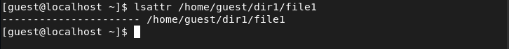
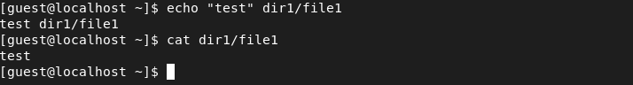
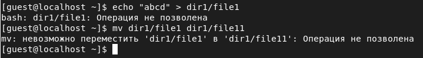
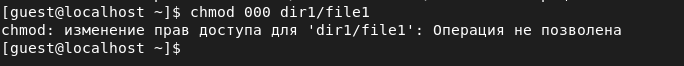
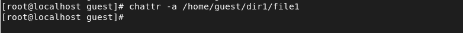
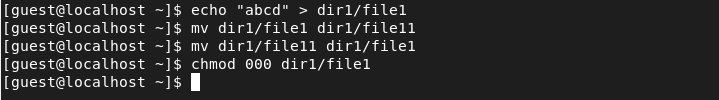

---
## Front matter
lang: ru-RU
title: Лабораторная работа №4
author: Асеева Яна Олеговна
documentclass: article
papersize: a4
toc: false
slide_level: 2
aspectratio: 20
section-titles: true
##Fonts
fontsize: 12pt
mainfont: PT Serif
romanfont: PT Serif
sansfont: PT Sans
monofont: PT Mono
mainfontoptions: Ligatures=TeX
romanfontoptions: Ligatures=TeX
sansfontoptions: Ligatures=TeX,Scale=MatchLowercase
monofontoptions: Scale=MatchLowercase,Scale=0.9
---

# 
Лабораторная работа №4

**Автор: Асеева Яна Олеговна**

**Группа: НКНбд-01-19**

## Цель выполнения лабораторной работы

Получение практических навыков работы в консоли с расширенными атрибутами файлов.

## Определение расширенных атрибутов файла file1 от имени пользователя guest

## Установка прав, разрешающих чтение и запись для владельца файла

## Установка расширенных атрибутов a от имени пользователя guest

## Установка расширенных атрибутов a от имени суперпользователя 

## Проверка правильности установления атрибута от guest

## Дозапись в файл file1 слова «test»

## Удаление и переименование файла file1

## Установка прав на файл file1

## Снятие расширенного атрибута a. Повтор невыполненных операций

## Замена атрибута «a» атрибутом «i»

## Выводы

В ходе выполнения лабораторной работы я получила практические навыки работы в консоли с расширенными атрибутами файлов.
