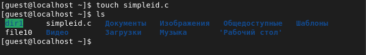
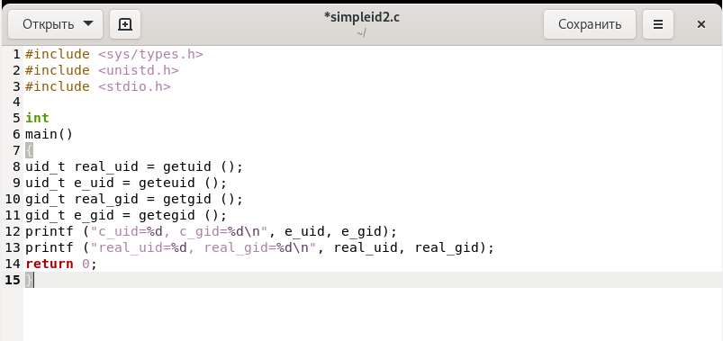
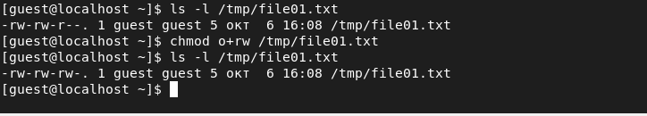

---
# Front matter
lang: ru-Ru
title: "Лабораторная работа №5"
subtitle: "Дискреционное разграничение прав в Linux. Исследование влияния дополнительных атрибутов"
author: "Асеева Яна Олеговна"

# Formatting
toc-title: "Содержание"
toc: true # Table of contents
toc_depth: 2
lof: true # List of figures
lot: true # List of tables
fontsize: 12pt
linestretch: 1.5
papersize: a4paper
documentclass: scrreprt
polyglossia-lang: russian
polyglossia-otherlangs: english
mainfont: PT Serif
romanfont: PT Serif
sansfont: PT Sans
monofont: PT Mono
mainfontoptions: Ligatures=TeX
romanfontoptions: Ligatures=TeX
sansfontoptions: Ligatures=TeX,Scale=MatchLowercase
monofontoptions: Scale=MatchLowercase
indent: true
pdf-engine: xelatex
header-includes:
  - \linepenalty=10 # the penalty added to the badness of each line within a paragraph (no associated penalty node) Increasing the value makes tex try to have fewer lines in the paragraph.
  - \interlinepenalty=0 # value of the penalty (node) added after each line of a paragraph.
  - \hyphenpenalty=50 # the penalty for line breaking at an automatically inserted hyphen
  - \exhyphenpenalty=50 # the penalty for line breaking at an explicit hyphen
  - \binoppenalty=700 # the penalty for breaking a line at a binary operator
  - \relpenalty=500 # the penalty for breaking a line at a relation
  - \clubpenalty=150 # extra penalty for breaking after first line of a paragraph
  - \widowpenalty=150 # extra penalty for breaking before last line of a paragraph
  - \displaywidowpenalty=50 # extra penalty for breaking before last line before a display math
  - \brokenpenalty=100 # extra penalty for page breaking after a hyphenated line
  - \predisplaypenalty=10000 # penalty for breaking before a display
  - \postdisplaypenalty=0 # penalty for breaking after a display
  - \floatingpenalty = 20000 # penalty for splitting an insertion (can only be split footnote in standard LaTeX)
  - \raggedbottom # or \flushbottom
  - \usepackage{float} # keep figures where there are in the text
  - \floatplacement{figure}{H} # keep figures where there are in the text
---

# Цель работы

Изучение механизмов изменения идентификаторов, применения SetUID- и Sticky-битов. Получение практических навыков работы в консоли с дополнительными атрибутами. Рассмотрение работы механизма смены идентификатора процессов пользователей, а также влияние бита Sticky на запись и удаление файлов.

# Выполнение лабораторной работы

1.С помощью команды gcc -v убедилась, что у меня установлен компилятор gcc (рис.1).

рис.1

2.Вошла в систему от имени пользователя guest. Создала программу simpleid.c (рис.2-3). 

рис.2

рис.3

3.Скомпилировала программу и убедитесь, что файл программы создан: gcc simpleid.c -o simpleid (рис.4). 

рис.4

4.Выполнила программу simpleid: ./simpleid (рис.5).

рис.5

5.Выполнила системную программу id: id (рис.6).

рис.6

 Полученный мною результат совпал с данными предыдущего пункта задания. 

6.Усложнила программу, добавив вывод действительных идентификаторов. Получившуюся программу назвала simpleid2.c (рис.7-8). 

рис.7

рис. 8

7.Скомпилировала и запустила simpleid2.c: 

gcc simpleid2.c -o simpleid2 

./simpleid2 

(рис.9)

рис.9

8.От имени суперпользователя выполнила команды:

chown root:guest /home/guest/simpleid2 

chmod u+s /home/guest/simpleid2

(рис.10-11)

рис.10

рис.11

Команда chown root:guest /home/guest/simpleid2 меняет владельца файла. 

Команда chmod u+s /home/guest/simpleid2 меняет права доступа к файлу.

9.Выполнила проверку правильности установки новых атрибутов и смены владельца файла simpleid2: ls -l simpleid2 (рис.12).

рис.12

10.Запустила simpleid2 и id:

./simpleid2

id

(рис.13)

рис.13

В отличие от предыдущих результатов, я получила значения 0. 

11.Проделала тоже самое относительно SetGID-бита (рис.14-16).

рис.14

рис.15

рис.16

12.Создала программу readfile.c (рис.17).

рис.17

13.Откомпилировала её: gcc readfile.c -o readfile (рис.18).

рис.18

14.Сменила владельца у файла readfile.c  и изменила права так, чтобы только суперпользователь (root) мог прочитать его, a guest не мог (рис.19).

рис.19

15.Проверила, что пользователь guest не может прочитать файл readfile.c (рис.20).

рис.20

16.Сменила у программы readfile владельца и установила SetUID-бит (рис.21).

рис.21

17.Проверила, может ли программа readfile прочитать файл readfile.c (рис.22).

рис.22

18.Проверила, может ли программа readfile прочитать файл /etc/shadow (рис.23-24).

рис.23

рис.24

Так как у программы установлен SetUID-бит, то ей временно предоставляются права владельца файла. 

19.Выяснила, установлен ли атрибут Sticky на директории /tmp, для чего выполнила команду ls -l / | grep tmp (рис.25).

рис.25

20.От имени пользователя guest создала файл file01.txt в директории /tmp со словом test: echo "test" > /tmp/file01.txt (рис.26).

рис.26

21.Просмотрила атрибуты у только что созданного файла и разрешила чтение и запись для категории пользователей «все остальные»: 

ls -l /tmp/file01.txt 

chmod o+rw /tmp/file01.txt 

ls -l /tmp/file01.txt

(рис.27)

рис.27

22.От пользователя guest2 (не являющегося владельцем) попробовала  прочитать файл /tmp/file01.txt: cat /tmp/file01.txt (рис.28).

рис.28

23.От пользователя guest2 попробовала дозаписать в файл /tmp/file01.txt слово test2 командой echo "test2" > /tmp/file01.txt (рис.29).

рис.29

Операцию удалось выполнить.

24.Проверила содержимое файла командой cat /tmp/file01.txt (рис.30).

рис.30

25.От пользователя guest2 попробовала записать в файл /tmp/file01.txt слово test3, стерев при этом всю имеющуюся в файле информацию командой echo "test3" > /tmp/file01.txt (рис.31).

рис.31

Операцию удалось выполнить.

26.Проверила содержимое файла командой cat /tmp/file01.txt (рис.32).

рис.32

27.От пользователя guest2 попробовала удалить файл /tmp/file01.txt командой rm /tmp/file01.txt

(рис.33).

рис.33

Операцию выполнить не удалось.

28.Повысила свои права до суперпользователя командой su и выполнила после этого команду, снимающую атрибут t (Sticky-бит) с директории /tmp: chmod -t /tmp (рис.34).

рис.34

29.Покинула режим суперпользователя командой exit (рис.35).

рис.35

30.От пользователя guest2 проверила, что атрибута t у директории /tmp нет: ls -l / | grep tmp

(рис.36).

рис.36

31.Повторила предыдущие шаги (рис.37).

рис.37

Я смогла удалить файл от имени пользователя, не являющегося его владельцем. Sticky-bit позволяет защищать файлы от случайного удаления, когда несколько пользователей имеют права на запись в один и тот же каталог. Если у файла атрибут t стоит, значит пользователь может удалить файл, только если он является пользователем-владельцем файла или каталога, в котором содержится файл. Если же этот атрибут не установлен, то удалить файл могут все пользователи, которым позволено удалять файлы из каталога.

32.Повысила свои права до суперпользователя и вернула атрибут t на директорию /tmp: 

su 

chmod +t /tmp 

exit

(рис.38)

рис.38

# Выводы

В ходе выполнения лабораторной работы я изучила механизмы изменения идентификаторов, применения SetUID- и Sticky-битов. Я получила практические навыки работы в консоли с дополнительными атрибутами. Я рассмотрела работу механизма смены идентификатора процессов пользователей, а также влияние бита Sticky на запись и удаление файлов.

# Список литературы

1.Кулябов Д. С., Королькова А. В., Геворкян М. Н Лабораторная работа №5.
