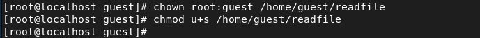
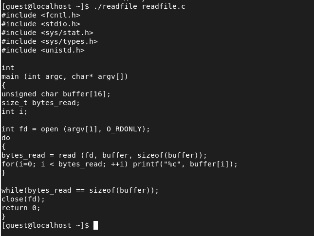
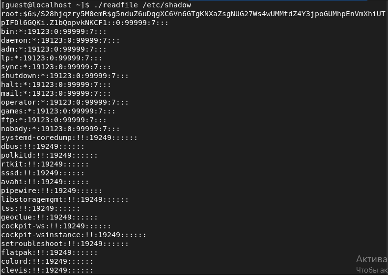
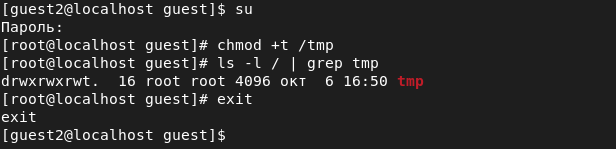
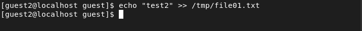
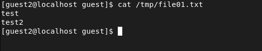
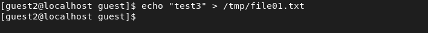
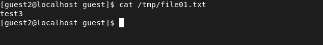
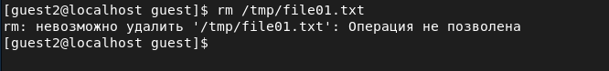

---
## Front matter
lang: ru-RU
title: Лабораторная работа №6
author: Асеева Яна Олеговна
documentclass: article
papersize: a4
toc: false
slide_level: 2
aspectratio: 20
section-titles: true
##Fonts
fontsize: 12pt
mainfont: PT Serif
romanfont: PT Serif
sansfont: PT Sans
monofont: PT Mono
mainfontoptions: Ligatures=TeX
romanfontoptions: Ligatures=TeX
sansfontoptions: Ligatures=TeX,Scale=MatchLowercase
monofontoptions: Scale=MatchLowercase,Scale=0.9
---

# 
Лабораторная работа №6

**Автор: Асеева Яна Олеговна**

**Группа: НКНбд-01-19**

## Цель выполнения лабораторной работы

Изучение механизмов изменения идентификаторов, применения SetUID- и Sticky-битов. Получение практических навыков работы в консоли с дополнительными атрибутами. Рассмотрение работы механизма смены идентификатора процессов пользователей, а также влияние бита Sticky на запись и удаление файлов.

## SetUID-бит

SetUID (сокращения от англ. set user ID upon execution — "установка ID пользователя во время выполнения") разрешает пользователям запускать исполняемые файлы с правами владельца исполняемого файла. Иногда файлы требуют разрешения на выполнение для пользователей, которые не являются членами группы владельца, в этом случае потребуется предоставить специальные разрешения на выполнение. Когда SetUID установлен, пользователь может запускать любую программу, как её владелец.

Команда chown root:guest /home/guest/simpleid2 меняет владельца файла. Команда chmod u+s /home/guest/simpleid2 устанавливает SetUID-бит.

## Результат установки SetUID-бита

## Результат установки SetUID-бита

## Sticky-бит

В случае, если этот бит установлен для папки, то файлы в этой папке могут быть удалены только их владельцем. Пример использования этого бита в операционной системе это системная папка /tmp . Эта папка разрешена на запись любому пользователю, но удалять файлы в ней могут только пользователи, являющиеся владельцами этих файлов. Символ «t» указывает, что на папку установлен Sticky Bit.

## Результат применения Sticky-бит

Пользователь guest2 не является владельцем.

## Результат применения Sticky-бит

Пользователь guest2 не является владельцем.

## Результат применения Sticky-бит

Пользователь guest2 не является владельцем.

## Выводы

В ходе выполнения лабораторной работы я изучила механизмы изменения идентификаторов, применения SetUID- и Sticky-битов. Я получила практические навыки работы в консоли с дополнительными атрибутами. Я рассмотрела работу механизма смены идентификатора процессов пользователей, а также влияние бита Sticky на запись и удаление файлов.
