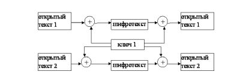
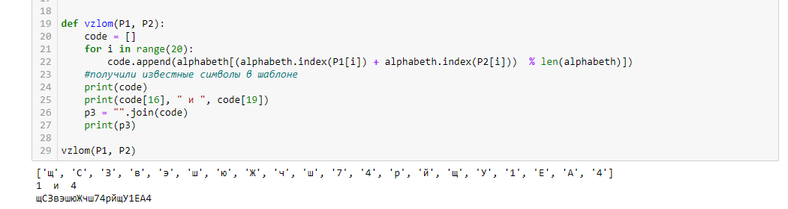
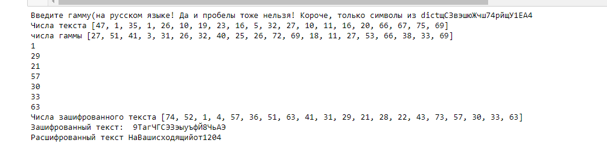

---
## Front matter
lang: ru-RU
title: Лабораторная работа №8
author: Асеева Яна Олеговна
documentclass: article
papersize: a4
toc: false
slide_level: 2
aspectratio: 20
section-titles: true
##Fonts
fontsize: 12pt
mainfont: PT Serif
romanfont: PT Serif
sansfont: PT Sans
monofont: PT Mono
mainfontoptions: Ligatures=TeX
romanfontoptions: Ligatures=TeX
sansfontoptions: Ligatures=TeX,Scale=MatchLowercase
monofontoptions: Scale=MatchLowercase,Scale=0.9
---

# 
Лабораторная работа №8

**Автор: Асеева Яна Олеговна**

**Группа: НКНбд-01-19**

## Цель выполнения лабораторной работы

Освоить на практике применение режима однократного гаммирования на примере кодирования различных исходных текстов одним ключом. 

## Общая схема шифрования двух различный текстов одним ключом

Открытый текст можно найти, зная шифротекст двух телеграмм, зашифрованных одним ключом. 

## Результат работы приложения

## Результат работы приложения 

## Выводы

В ходе выполнения лабораторной работы я освоила на практике применение режима однократного гаммирования на примере кодирования различных исходных текстов одним ключом.
